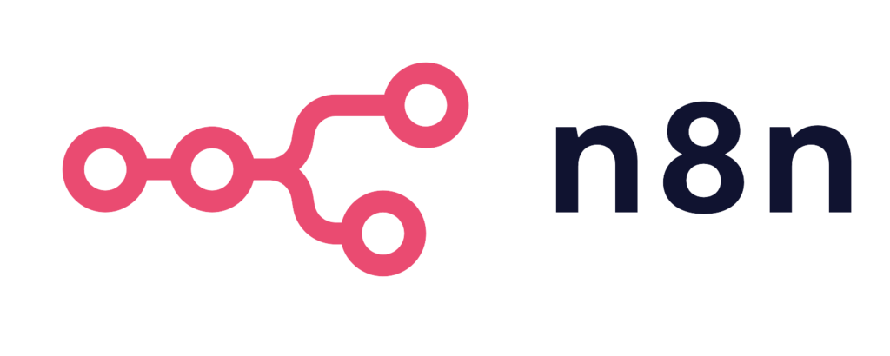
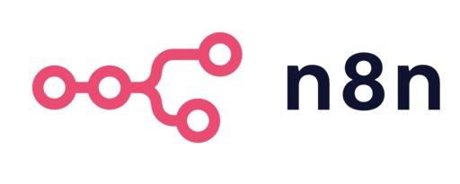
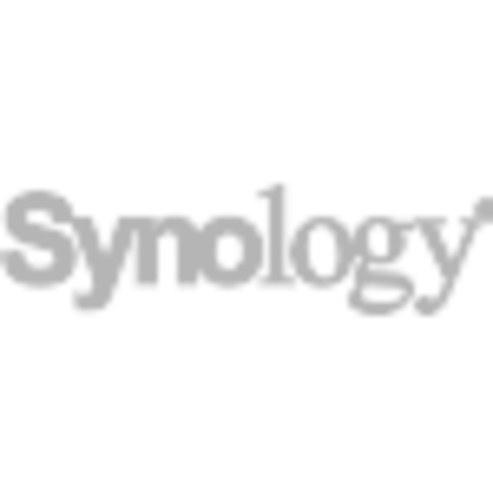
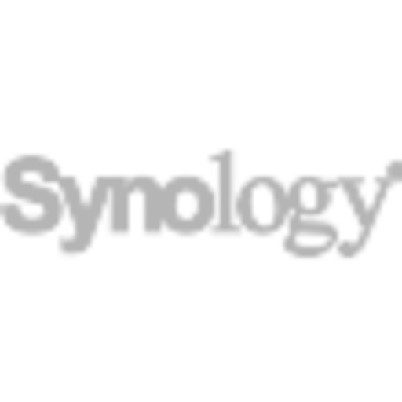

# Logo Visual Preview

This document provides a comprehensive visual preview of all logos in the repository, in all available formats and resolutions.

## 📊 Overview

- **2 brands**: n8n and Synology
- **2 variants per brand**: Full logo (with text) and Simple icon (symbol only)
- **8 resolutions per variant**: SVG + 7 PNG sizes (16px to 1024px)
- **Total files**: 32 logo files

---

## 🎨 n8n Logos

### Full Logo (with text)

The complete n8n logo including the "n8n" text and connection symbols.

#### SVG (Vector - Infinite Resolution)

**File**: `assets/logos/n8n/n8n-logo.svg` (2.8 KB)
**Use case**: Web, print, Package Center icon

#### PNG Raster Versions

| Size | Preview | File | Use Case |
|------|---------|------|----------|
| **1024px** |  | `n8n-logo-1024.png` (48 KB) | High-resolution displays, marketing |
| **512px** |  | `n8n-logo-512.png` (24 KB) | Standard web display |
| **256px** |  | `n8n-logo-256.png` (12 KB) | Synology Package Center |
| **128px** |  | `n8n-logo-128.png` (4 KB) | Small icons, lists |
| **64px** |  | `n8n-logo-64.png` (4 KB) | Compact displays |
| **32px** |  | `n8n-logo-32.png` (4 KB) | Favicons, toolbars |
| **16px** |  | `n8n-logo-16.png` (4 KB) | Tiny favicons |

---

### Simple Icon (symbol only)

The circular n8n icon without text - just the connection symbol.

#### SVG (Vector - Infinite Resolution)

**File**: `assets/logos/n8n/n8n-simple-icon.svg` (1.6 KB)
**Use case**: App icons, avatars, compact displays

#### PNG Raster Versions

| Size | Preview | File | Use Case |
|------|---------|------|----------|
| **1024px** |  | `n8n-simple-icon-1024.png` (400 KB) | High-res app icons |
| **512px** |  | `n8n-simple-icon-512.png` (120 KB) | Standard app icons |
| **256px** |  | `n8n-simple-icon-256.png` (16 KB) | Medium icons |
| **128px** |  | `n8n-simple-icon-128.png` (8 KB) | List view icons |
| **64px** |  | `n8n-simple-icon-64.png` (4 KB) | Compact icons |
| **32px** |  | `n8n-simple-icon-32.png` (4 KB) | Small icons |
| **16px** |  | `n8n-simple-icon-16.png` (4 KB) | Tiny icons |

---

## 🔷 Synology Logos

### Full Logo (with text)

The complete Synology logo including the company name.

#### SVG (Vector - Infinite Resolution)

**File**: `assets/logos/synology/synology-logo.svg` (12 KB)
**Use case**: Documentation, README, presentations

#### PNG Raster Versions

| Size | Preview | File | Use Case |
|------|---------|------|----------|
| **1024px** |  | `synology-logo-1024.png` (84 KB) | High-resolution displays |
| **512px** |  | `synology-logo-512.png` (36 KB) | Standard web display |
| **256px** |  | `synology-logo-256.png` (16 KB) | Medium displays |
| **128px** |  | `synology-logo-128.png` (8 KB) | Small displays |
| **64px** |  | `synology-logo-64.png` (4 KB) | Compact displays |
| **32px** |  | `synology-logo-32.png` (4 KB) | Tiny displays |
| **16px** |  | `synology-logo-16.png` (4 KB) | Micro displays |

---

### Simple Icon (symbol only)

The Synology cube icon without text.

#### SVG (Vector - Infinite Resolution)

**File**: `assets/logos/synology/synology-simple-icon.svg` (5.1 KB)
**Use case**: App icons, badges, compact displays

#### PNG Raster Versions

| Size | Preview | File | Use Case |
|------|---------|------|----------|
| **1024px** |  | `synology-simple-icon-1024.png` (372 KB) | High-res app icons |
| **512px** |  | `synology-simple-icon-512.png` (32 KB) | Standard app icons |
| **256px** |  | `synology-simple-icon-256.png` (16 KB) | Medium icons |
| **128px** |  | `synology-simple-icon-128.png` (12 KB) | List view icons |
| **64px** |  | `synology-simple-icon-64.png` (4 KB) | Compact icons |
| **32px** |  | `synology-simple-icon-32.png` (4 KB) | Small icons |
| **16px** |  | `synology-simple-icon-16.png` (4 KB) | Tiny icons |

---

## 📥 Download Links (GitHub Raw)

All logos are available via direct download from GitHub:

### n8n Logos

**Full Logo:**
- [SVG](https://raw.githubusercontent.com/josedacosta/n8n-synology-package/main/assets/logos/n8n/n8n-logo.svg)
- [1024px PNG](https://raw.githubusercontent.com/josedacosta/n8n-synology-package/main/assets/logos/n8n/n8n-logo-1024.png)
- [512px PNG](https://raw.githubusercontent.com/josedacosta/n8n-synology-package/main/assets/logos/n8n/n8n-logo-512.png)
- [256px PNG](https://raw.githubusercontent.com/josedacosta/n8n-synology-package/main/assets/logos/n8n/n8n-logo-256.png)
- [128px PNG](https://raw.githubusercontent.com/josedacosta/n8n-synology-package/main/assets/logos/n8n/n8n-logo-128.png)
- [64px PNG](https://raw.githubusercontent.com/josedacosta/n8n-synology-package/main/assets/logos/n8n/n8n-logo-64.png)
- [32px PNG](https://raw.githubusercontent.com/josedacosta/n8n-synology-package/main/assets/logos/n8n/n8n-logo-32.png)
- [16px PNG](https://raw.githubusercontent.com/josedacosta/n8n-synology-package/main/assets/logos/n8n/n8n-logo-16.png)

**Simple Icon:**
- [SVG](https://raw.githubusercontent.com/josedacosta/n8n-synology-package/main/assets/logos/n8n/n8n-simple-icon.svg)
- [1024px PNG](https://raw.githubusercontent.com/josedacosta/n8n-synology-package/main/assets/logos/n8n/n8n-simple-icon-1024.png)
- [512px PNG](https://raw.githubusercontent.com/josedacosta/n8n-synology-package/main/assets/logos/n8n/n8n-simple-icon-512.png)
- [256px PNG](https://raw.githubusercontent.com/josedacosta/n8n-synology-package/main/assets/logos/n8n/n8n-simple-icon-256.png)
- [128px PNG](https://raw.githubusercontent.com/josedacosta/n8n-synology-package/main/assets/logos/n8n/n8n-simple-icon-128.png)
- [64px PNG](https://raw.githubusercontent.com/josedacosta/n8n-synology-package/main/assets/logos/n8n/n8n-simple-icon-64.png)
- [32px PNG](https://raw.githubusercontent.com/josedacosta/n8n-synology-package/main/assets/logos/n8n/n8n-simple-icon-32.png)
- [16px PNG](https://raw.githubusercontent.com/josedacosta/n8n-synology-package/main/assets/logos/n8n/n8n-simple-icon-16.png)

### Synology Logos

**Full Logo:**
- [SVG](https://raw.githubusercontent.com/josedacosta/n8n-synology-package/main/assets/logos/synology/synology-logo.svg)
- [1024px PNG](https://raw.githubusercontent.com/josedacosta/n8n-synology-package/main/assets/logos/synology/synology-logo-1024.png)
- [512px PNG](https://raw.githubusercontent.com/josedacosta/n8n-synology-package/main/assets/logos/synology/synology-logo-512.png)
- [256px PNG](https://raw.githubusercontent.com/josedacosta/n8n-synology-package/main/assets/logos/synology/synology-logo-256.png)
- [128px PNG](https://raw.githubusercontent.com/josedacosta/n8n-synology-package/main/assets/logos/synology/synology-logo-128.png)
- [64px PNG](https://raw.githubusercontent.com/josedacosta/n8n-synology-package/main/assets/logos/synology/synology-logo-64.png)
- [32px PNG](https://raw.githubusercontent.com/josedacosta/n8n-synology-package/main/assets/logos/synology/synology-logo-32.png)
- [16px PNG](https://raw.githubusercontent.com/josedacosta/n8n-synology-package/main/assets/logos/synology/synology-logo-16.png)

**Simple Icon:**
- [SVG](https://raw.githubusercontent.com/josedacosta/n8n-synology-package/main/assets/logos/synology/synology-simple-icon.svg)
- [1024px PNG](https://raw.githubusercontent.com/josedacosta/n8n-synology-package/main/assets/logos/synology/synology-simple-icon-1024.png)
- [512px PNG](https://raw.githubusercontent.com/josedacosta/n8n-synology-package/main/assets/logos/synology/synology-simple-icon-512.png)
- [256px PNG](https://raw.githubusercontent.com/josedacosta/n8n-synology-package/main/assets/logos/synology/synology-simple-icon-256.png)
- [128px PNG](https://raw.githubusercontent.com/josedacosta/n8n-synology-package/main/assets/logos/synology/synology-simple-icon-128.png)
- [64px PNG](https://raw.githubusercontent.com/josedacosta/n8n-synology-package/main/assets/logos/synology/synology-simple-icon-64.png)
- [32px PNG](https://raw.githubusercontent.com/josedacosta/n8n-synology-package/main/assets/logos/synology/synology-simple-icon-32.png)
- [16px PNG](https://raw.githubusercontent.com/josedacosta/n8n-synology-package/main/assets/logos/synology/synology-simple-icon-16.png)

---
